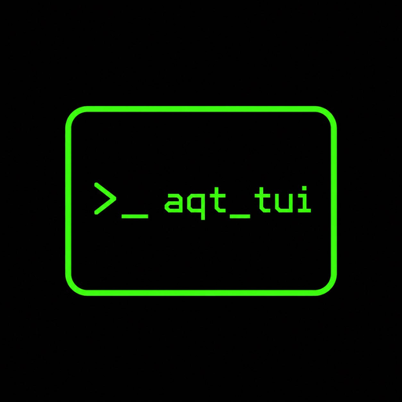
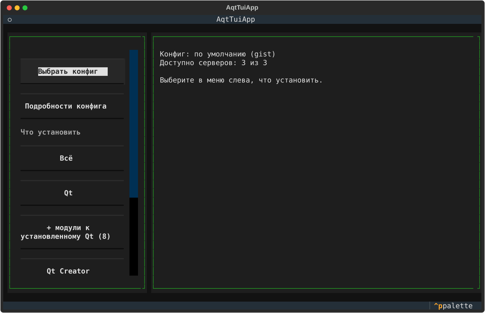

<p align="center">
  
</p>

<h1 align="center">aqt_tui</h1>

<p align="center">
  Терминальный интерфейс для установки Qt, Qt Creator, документации и инструментов
  через <a href="https://github.com/miurahr/aqtinstall">aqtinstall</a>
</p>

<p align="center">
  
</p>

## Зачем

[aqtinstall](https://github.com/miurahr/aqtinstall) ставит Qt без официального онлайн-установщика
и без учётной записи Qt, но это консольная утилита. Чтобы ей пользоваться, нужно знать точные
имена хостов, платформ, архитектур и модулей (`linux desktop 6.8.3 linux_gcc_64 -m qtcharts …`)
и вручную подбирать рабочие зеркала, если `download.qt.io` недоступен.

aqt_tui делает то же самое через пошаговое меню в терминале:

- проверяет зеркала из конфига и работает только с доступными;
- показывает реальные списки версий, компиляторов и модулей с сервера: с описанием и размером;
- ставит Qt, Qt Creator, CMake, Ninja, документацию и примеры, по отдельности или всё сразу;
- находит уже установленный Qt и доустанавливает к нему недостающие модули;
- показывает лог установки и прогресс.

## Требования

- Python 3.12 или новее
- Linux, macOS или Windows. Проверено на Linux.

## Установка и запуск

```bash
git clone https://github.com/trmolion/aqt_tui.git
cd aqt_tui

python -m venv .venv
source .venv/bin/activate        # Windows: .venv\Scripts\activate
pip install -e .

python main.py
```

При следующих запусках достаточно активировать окружение и выполнить `python main.py`.

## Как пользоваться

1. **Выбрать конфиг.** Нажмите «Выбрать конфиг» и выберите источник. Можно взять конфиг
   по умолчанию, дать ссылку или указать локальный `.ini` (подробнее в разделе [«Конфиг»](#конфиг)).
   Приложение проверит зеркала из конфига, и откроются разделы установки.
2. **Выбрать раздел.** Выберите, что ставить:

   | Раздел | Что ставится |
   |---|---|
   | **Всё** | Qt с модулями, Qt Creator, CMake, Ninja и документация |
   | **Qt** | Qt выбранной версии и компилятора с отмеченными модулями |
   | **+ модули к установленному Qt** | новые модули к уже установленному Qt (кнопка есть, только если Qt найден) |
   | **Qt Creator** | последняя версия Qt Creator |
   | **Документация** | документация к выбранной версии Qt |
   | **Примеры** | примеры к выбранной версии Qt |
   | **Инструменты** | на выбор: Qt Creator, CMake, Ninja, Conan, Qt Installer Framework |

3. **Пройти шаги.** Слева появятся пронумерованные шаги раздела: ОС → платформа → версия →
   компилятор → модули → путь. Каждый следующий шаг открывается, когда пройден предыдущий.
   Справа видна сводка выбранного. Повторное нажатие на кнопку шага возвращает к сводке,
   «← Главное меню» возвращает к списку разделов.
4. **Установить.** Нажмите «Установить» и следите за логом. Лог также сохраняется в папку установки:
   `install_qt.log` и `aqtinstall.log`.

Выбранные ОС, версия и путь общие для всех разделов. Например, после установки Qt можно перейти
в «Документацию», и там уже будут подставлены та же ОС и тот же путь.

### Управление

| Клавиша | Действие |
|---|---|
| `Tab` / `Shift+Tab` | переход между элементами |
| `↑` `↓` | перемещение по спискам и таблицам |
| `Enter` | нажать кнопку, выбрать строку |
| `Пробел` | отметить пункт в списке |
| `Ctrl+P` | палитра команд, в том числе смена темы |
| `Ctrl+Q` | выход |

Мышь тоже работает.

### Куда ставится

Всё ставится в выбранную папку в раскладке aqt:

```
<папка>/
├── 6.8.3/gcc_64/          # Qt
├── Tools/QtCreator/       # Qt Creator
├── Tools/CMake/, Tools/Ninja/
├── Docs/Qt-6.8.3/         # документация
└── Examples/Qt-6.8.3/     # примеры
```

### Доустановка модулей

При запуске aqt_tui ищет установленные Qt:
- в каталогах из `PATH`;
- в путях из `~/.bashrc`, `~/.zshrc`, `~/.profile` и других rc-файлов оболочки;
- в домашней папке.

Если Qt найден, под кнопкой «Qt» появляется кнопка «+ модули …». В таблице модулей уже
установленные отмечены серым X и не снимаются. Отметьте новые модули, и будут скачаны только они,
без повторной установки самого Qt.

Qt, установленный пакетным менеджером (например, в `/usr`), только показывается на главном экране.
Модули к нему ставятся через тот же пакетный менеджер, например `sudo pacman -S qt6-charts`.

## Конфиг

Кнопка «Выбрать конфиг» предлагает три источника:

- **Конфиг по умолчанию** — [aqt.ini из gist](https://gist.github.com/pandazz77/a8a00ccf5e1d8b4d8289337f4cedbfd4);
- **Удалённый конфиг по ссылке** — прямая ссылка на `.ini` или ссылка на страницу GitHub Gist;
- **Локальный файл** — `.ini` на диске.

Конфиг — это обычный [settings.ini aqtinstall](https://aqtinstall.readthedocs.io/en/latest/configuration.html):
`baseurl`, `fallbacks`, `trusted_mirrors`, таймауты и т. д.

Последний скачанный конфиг хранится в `~/.cache/aqt-tui/configs/`, предыдущие копии удаляются.
После загрузки проверяются серверы из конфига, и открываются разделы установки.

## Проверка хешей

При установке aqt проверяет каждый скачанный архив по sha256-хешу. Хеши скачиваются
не с того зеркала, откуда идёт загрузка, а с доверенных серверов (`trusted_mirrors`),
по умолчанию — `https://download.qt.io`. Эти настройки берутся из `.ini`-конфига,
выбранного кнопкой «Выбрать конфиг».

Если установка падает с ошибкой `Failed to download checksum`, значит, доверенный сервер
недоступен.

### Вариант 1 (рекомендуется): указать другой доверенный сервер

```ini
[mirrors]
trusted_mirrors:
    https://mirror.yandex.ru/mirrors/qt.io
```

### Вариант 2: отключить проверку хешей

```ini
[requests]
INSECURE_NOT_FOR_PRODUCTION_ignore_hash: True
```

> ⚠️ Без проверки хешей архивы с зеркала ставятся как есть: подменённый или повреждённый
> пакет не будет обнаружен. Используйте только с зеркалами, которым доверяете.

Когда проверка отключена, в логе установки появляется строка
`WARNING: hash verification is DISABLED`.

## Лицензия

[GPL-3.0](LICENSE)
